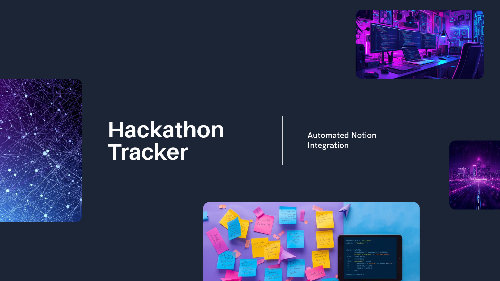

# 🚀 Hackathon Tracker - Notion Automation


[](https://www.python.org/)
[](https://developers.notion.com/)
[](LICENSE)
[](https://github.com/Swapnilpawar17/hackathon-tracker)

Automatically discover, scrape, and track hackathons for CSE/IT students and freshers in a Notion database. Never miss a hackathon opportunity again!

## 🌟 Features

- 🔍 **Multi-Platform Scraping**: Automatically scrapes hackathons from Devfolio, MLH, HackerEarth, Devpost, and more
- 📚 **Curated Collection**: Manually verified hackathons including Smart India Hackathon, Google Solution Challenge, Microsoft Imagine Cup
- 🎯 **Fresher-Focused**: Filters hackathons suitable for 2025 batch students and beginners
- 🔄 **Duplicate Detection**: Smart system to avoid duplicate entries
- 📊 **Notion Integration**: Direct updates to your Notion database
- ⏰ **Automation Ready**: Weekly scheduled updates support
- 🌍 **Global + India**: Tracks both international and India-specific hackathons

## 📸 Screenshots

<details>
<summary>Click to view screenshots</summary>

### Notion Database View


### Script Running


</details>

## 🚀 Quick Start

### Prerequisites

- Python 3.8 or higher
- Notion account
- 10 minutes for setup

### Installation

1. **Clone the repository**
```bash
git clone https://github.com/Swapnilpawar17/hackathon-tracker.git
cd hackathon-tracker
Create virtual environment
Bash

python -m venv venv

# Windows
venv\Scripts\activate

# Mac/Linux
source venv/bin/activate
Install dependencies
Bash

pip install -r requirements.txt
Set up Notion Integration

Go to Notion Integrations
Create new integration named "Hackathon Scraper"
Copy the Integration Token
Create Notion Database

Create a new Notion page
Add a table with properties (see Database Schema)
Share with your integration
Configure environment variables

Create .env file in project root:

env

NOTION_TOKEN=your_integration_token_here
NOTION_DATABASE_ID=your_database_id_here
Run the scraper
Bash

python main.py
📊 Database Schema
Create a Notion database with these properties:

Property	Type	Options/Notes
Name	Title	Hackathon name
Platform	Select	Devfolio, Unstop, MLH, Devpost, HackerEarth, Other
Mode	Select	Online, Offline, Hybrid
Status	Select	Live, Upcoming, Closed
Fresher Friendly	Checkbox	✓ for beginner-friendly
Registration Link	URL	Direct registration link
Organizer	Text	Organizing body
Prize Pool	Text	Prize amount
Last Updated	Date	Auto-updated timestamp
💻 Usage
Manual Run (One-time)
Bash

python main.py
Test Connection
Bash

python test_connection.py
Run Scraper Only (without Notion)
Bash

python scrapers.py
Automated Weekly Updates
Bash

python scheduler.py
# Runs every Monday at 9 AM
Add Custom Hackathons
Edit manual_sources.py:

Python

{
    'name': 'Hackathon Name',
    'platform': 'Platform',
    'organizer': 'Organizer',
    'mode': 'Online/Offline/Hybrid',
    'registration_link': 'https://...',
    'prize_pool': '$10,000',
    'fresher_friendly': True,
    'status': 'Live/Upcoming',
}
📁 Project Structure
text

hackathon-tracker/
│
├── 📄 main.py                 # Main orchestrator
├── 🕷️ scrapers.py             # Web scraping logic
├── 📚 manual_sources.py       # Curated hackathon list
├── ⏰ scheduler.py            # Automation scheduler
├── 🧪 test_connection.py      # Connection tester
├── ➕ add_test_hackathon.py   # Test hackathon adder
│
├── 📝 README.md               # Documentation
├── 📦 requirements.txt        # Dependencies
├── 🔒 .env                    # Credentials (not committed)
├── 🚫 .gitignore             # Git ignore rules
└── 📜 LICENSE                # MIT License
🔄 Automation Options
Option 1: Manual Weekly Run
Run python main.py every week

Option 2: Python Scheduler
Keep terminal open with:

Bash

python scheduler.py
Option 3: Windows Task Scheduler
Open Task Scheduler
Create Basic Task
Set trigger: Weekly, Monday 9 AM
Set action: Start program
Program: python.exe path
Arguments: main.py
Option 4: Linux/Mac Cron
Bash

# Add to crontab
0 9 * * 1 cd /path/to/project && /usr/bin/python3 main.py
Option 5: Cloud Deployment
Deploy to free services:

Railway
Render
PythonAnywhere
📈 Current Coverage
Platforms Monitored
✅ Devpost - 9+ hackathons
✅ Devfolio - Major Indian hackathons
✅ MLH - Global student hackathons
✅ HackerEarth - Coding challenges
✅ Unstop - Indian competitions
✅ Manual Sources - Premium hackathons
Featured Hackathons
🇮🇳 Smart India Hackathon
🌍 Google Solution Challenge
💻 Microsoft Imagine Cup
🎓 MIT HackMIT
⚡ ETHIndia
🚀 AWS DeepRacer League
🐛 Troubleshooting
Issue	Solution
Connection fails	Check .env credentials, verify database sharing
No hackathons found	Websites may block scrapers, use manual sources
Duplicates added	Update notion-client: pip install --upgrade notion-client
Permission denied	Ensure integration has database access
🚀 Roadmap
 Add more platforms (CodeChef, Kaggle)
 Email notifications for new hackathons
 Telegram bot integration
 Filter by prize pool amount
 Deadline reminder system
 Team formation feature
 Export to CSV/Excel
 Web dashboard
🤝 Contributing
Contributions are welcome! Feel free to:

Fork the repository
Create feature branch (git checkout -b feature/AmazingFeature)
Commit changes (git commit -m 'Add AmazingFeature')
Push to branch (git push origin feature/AmazingFeature)
Open Pull Request
Areas for Contribution
Add new scraping sources
Improve error handling
Add more hackathons to manual sources
Create web interface
Add notification systems
📝 Requirements
Create requirements.txt:

txt

notion-client>=2.0.0
requests>=2.31.0
beautifulsoup4>=4.12.0
python-dotenv>=1.0.0
lxml>=4.9.0
schedule>=1.2.0
📜 License
This project is licensed under the MIT License - see the LICENSE file for details.

🙏 Acknowledgments
Built for CSE/IT students and 2025 batch freshers
Inspired by the need to track hackathon opportunities
Thanks to Notion API for database integration
Community contributions welcome
📞 Support
Issues: GitHub Issues
Discussions: GitHub Discussions
Email: your.email@example.com
⭐ Star History
Made with ❤️ by Swapnil Pawar